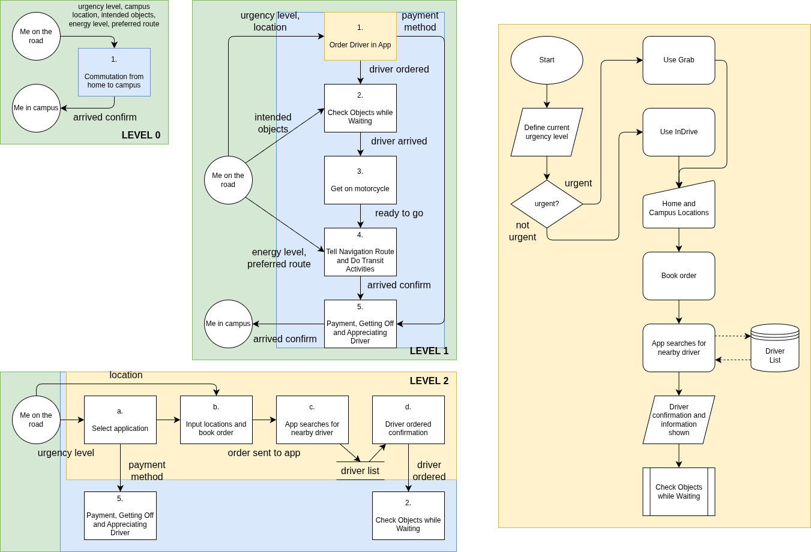

# PR 1 -- DFD (12/02/26)
**Task**:
1. Describe the process of your commute from your house to campus in a narration.
2. Represent that process in DFD with at least level 0 and level 1
3. Explain level 1 (or lower) with a flowchart diagram
4. Explicitly write the inputs, outputs, decision processes and decision variables in that process.

### Narration
After I finish every p`art of my morning routine and I'm ready to go, I order a Gojek to go to campus, setting the current location and destination which is Taman Ganesha. Oftenly, I order in InDrive because of its cheaper service cost, but soemtimes I use Grab if I'm in a hurry. I then wait for the driver.  
When the driver arrives, I wear a dedicated hood on my head to prevent direct contact between my head and their helmet, put on the helmet, and confirm to the driver that I'm ready. On the road, I usually take out my phone to read material for the classes on that day, search for electronic components for my projects, and check my socials. Since I live 45 minutes away from campus, I try to spend that time doing something productive, but sometimes if I'm tired I just close my eyes.  
Sometimes, the driver asks which way we should go, in which I always respond with what the Google Maps algorithm recommends.  
When we've arrived, I get off, take off the helmet and my hood, and ask for their preferred payment method and credentials if using InDrive or ask for the QRIS code if using Grab. After paying, I thank the driver and walk to class.

### Decomposition of Narration
1. Ordering for a driver to go to campus  
  * If not in a hurry, InDrive
  * If in a hurry, Grab  
    1. Location information sent, book order
    2. App search for driver
    3. Got driver
Data: urgency_level, app_selection, driver_ordered, campus_location, payment_method

2. Waiting for driver
  * Confirming brought objects  
    1. Remember needed things
    2. Look for remembered objects in bags
    3. If an object was not found, get it from the house
    4. Driver arrived
Data: bag_ready, bag_objects, intended_objects, driver_arrived 

3. Getting on the motorcycle  
  * Put on hood and helmet
  * Ready confirmation  
Data: go_ready

4. On the road  
  * Check phone  
    * Materials
    * Component listing
    * Socials
  * If tired, rest  
Data: preferred_route, energy_level

5. Getting off
  * Confirming 
  * Payment
    * If InDrive, ask for payment method and credentials and pay
    * If Grab, ask for QRIS and pay
  * Walk to campus  
Data: payment_method, arrived_confirm

### DFD and Flowchart

